# Ensuring Quality Releases

### Introduction

This project showcases the deployment and testing of a demo REST API on Microsoft Azure, leveraging industry-standard tools, notably Microsoft Azure, for seamless test environment creation and automated testing execution. The project also emphasizes monitoring and analyzing application behavior through custom log file queries to identify underlying issues.

Key components of our CI/CD pipeline include:

* A dedicated Azure resource group.
* An Azure App Service for hosting the REST API.
* A Virtual Network and Network Security Group for secure connectivity.
* A Virtual Machine provisioned by Terraform.


The automated pipeline efficiently deploys the REST API within the App Service, while the Virtual Machine, also set up by Terraform, serves as the base for executing various automated tests against the API.

### Getting Started
1. Clone this repository to your local machine.
```sh
git clone <repository_url>
```

2. Deploy your CI/CD pipeline by following the instructions provided in the next sections.

## Dependencies

Before you begin, ensure that you have the following dependencies set up:

Install the following tools:
  1. [Azure CLI](https://docs.microsoft.com/en-us/cli/azure/install-azure-cli?view=azure-cli-latest)
  2. [Terraform](https://www.terraform.io/downloads.html)
  3. [JMeter](https://jmeter.apache.org/download_jmeter.cgi)
  4. [Postman](https://www.postman.com/downloads/)
  5. [Python](https://www.python.org/downloads/)
  6. [Selenium](https://www.selenium.dev/)
  7. [Chromedriver](https://chromedriver.chromium.org/)
  8. [Chrome](https://www.google.com/intl/de_de/chrome/)

In [Azure DevOps](https://dev.azure.com), you also need to install:
* [Terraform](https://marketplace.visualstudio.com/items?itemName=ms-devlabs.custom-terraform-tasks)
* [Jmeter tasks](https://marketplace.visualstudio.com/items?itemName=AlexandreGattiker.jmeter-tasks)
* [PublishHTMLReports](https://marketplace.visualstudio.com/items?itemName=LakshayKaushik.PublishHTMLReports)

## Instructions

### Login

Log into your Azure account in the CLI using one of the following options:
    
- **Option a**: Run the following command, which will open a web page in your default web browser, allowing you to enter your Azure credentials:

```sh
az login
```

- **Option b**: Enter your credentials manually within the following command, replacing `<username>` and `<password>` with your Azure account information:

```sh
az login -u <username> -p <password>
```

### Create the Packer Image

To supply the VM's image for creation using Terraform, it's essential to specify an image. Initially, you'll have to modify the variables outlined within the `server.json` file, which includes the code responsible for building the Packer image.

```sh
    "variables": {
        "subscription_id": "",
        "tenant_id": "",
        "client_id": "",
        "client_secret": "",   
        "resource_group_name": "",
        "image_name": "",
        "vm_size": ""
    }
```

Once you have entered your variables, run the next line to create the image.
```
packer build server.json
```

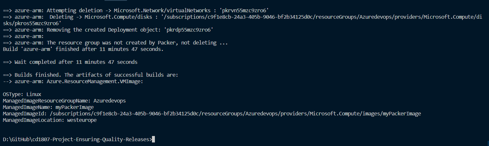

### Storage Account Configuration

You will need to create an storage account and retrieve some important information for terraform, position at terraform/environments/test and run the `configure-tfstate-storage-account.sh` file:

* Note: Don't forget to change the RESOURCE_GROUP_NAME="" if you are working with your own azure account.

```
chmod +x configure-tfstate-storage-account.sh
bash configure-tfstate-storage-account.sh
```

Update the `terraform/main.tf` file with the information generated by the .sh file:

```sh
terraform {
  backend "azurerm" {
    storage_account_name = "" 
    container_name       = "tfstate" 
    key                  = "test.terraform.tfstate"
    access_key           = "" 
  }
}
```

### Terraform

#### Update terraform variables

Replace the subscription variable values in the terraform/terraform.tfvars file, as applicable to you:

```
    subscription_id = ""
    client_id = ""
    client_secret = ""
    tenant_id = ""
    location = ""
    resource_group_name = ""
    application_type = ""
```

Generate SSH keys in the command shell

```
ssh-keygen -t rsa
cat ~/.ssh/id_rsa.pub
```

Update this key in terraform/modules/vm for vm.tf:

```
  admin_ssh_key {
    username   = var.vm_admin_username
    public_key = "..." # starts with "ssh-rsa"
  }
```

You can create the infrastructure by executing terraform if you want to make sure everything is working correctly.

```
terraform init
terraform validate
terraform apply
```

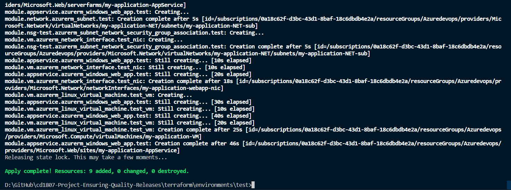

Later the pipeline will run the terraform files and create the infrastructure, so don't forget to remove the resources created by terraform in case you run the previous commands.

### Set up Azure DevOps (Pipeline)

For this project I'm using a self-hosted agent, go into https://dev.azure.com and follow these steps:

1. Create a new project.

2. Generate a personal access token (PAT) in Azure DevOps and store it locally on your computer. You will require this PAT to configure your agent on the VM for the "Build" step.

3. Establish a service connection named `myServiceC` with access to all pipelines (navigate to Project -> Project settings).

4. Form an agent pool named `myAgentPool` with access to all pipelines. Automatically add an agent using the Azure Resource Manager. Attach this agent to a new VM within the same resource group, which will handle the "Build" step.

5. Establish a new environment named `test-vm` (Azure Pipelines -> Environments) and allocate it to another new VM within the same resource group. This VM will be responsible for executing the "Deploy" and "Test" stages.

6. Create a new pipeline. Select GitHub and then choose your GitHub repository. Configure the pipeline by selecting "Existing Azure Pipelines YAML File" and choose the azure-pipelines.yaml file from the menu that appears on the right.

Update the variables:

```
variables:
  python.version: '3.8.10'
  azureServiceConnectionId: 'MyServiceC'
  projectRoot: $(System.DefaultWorkingDirectory)
  environmentName: 'test-vm'
  tfstatenumber: 'tfstate783534'
  tfrg: 'Azuredevops'
  application_type: 'project-qa'
  subscriptionId: 'c9f1e8cb-24a3-405b-9046-bf2b34125d0c' 
```
Click run and save, and the pipeline will start runing and create the resources:

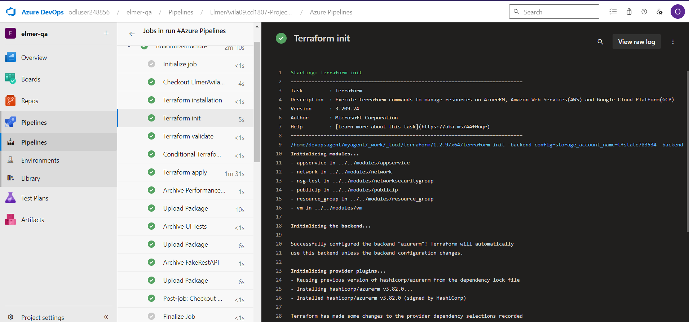
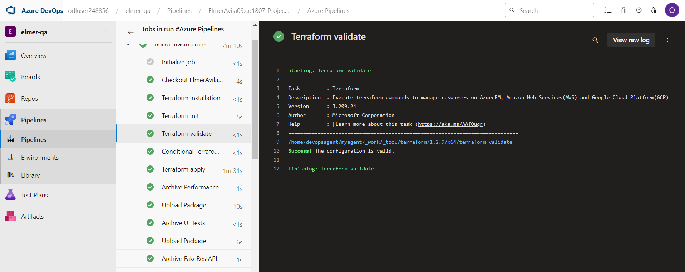
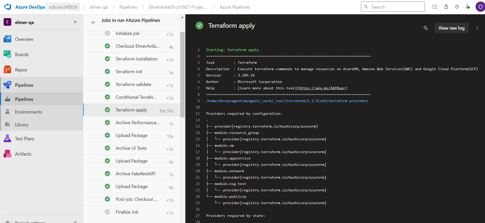

At the "Deploy" step your pipeline will deploy the FakeRestAPI as an app service at URL: `http://[application_type]-appservice.azurewebsites.net/`


Your API should look like this:
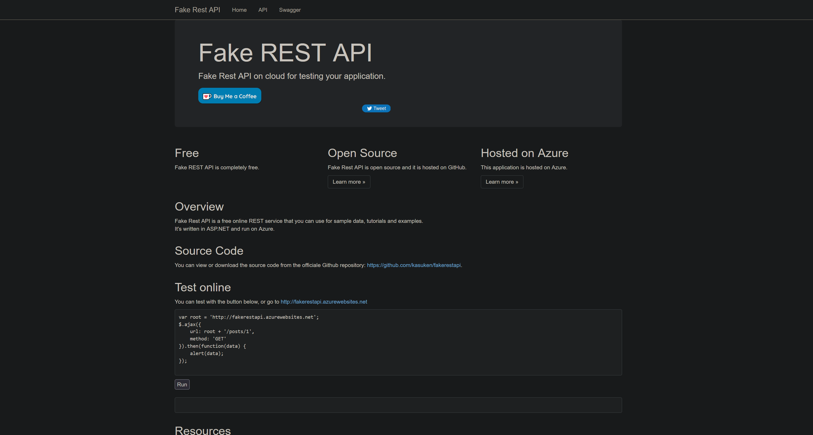

## Automated Testing

Here are screenshots on how your testing output should look like:

### Integration testing with Postman
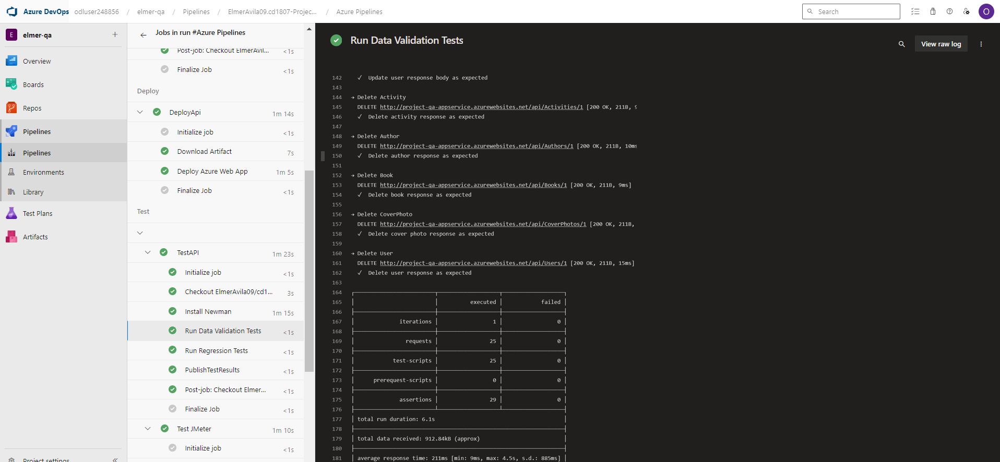

#### Regression Test
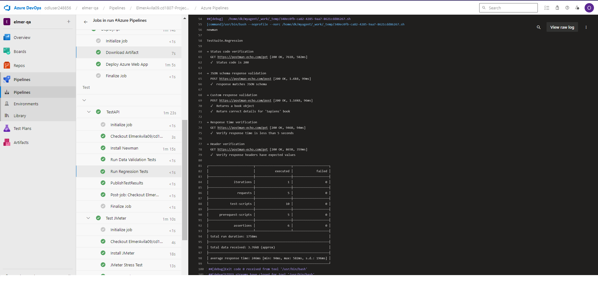

### Permormance Testing JMeter

#### Stress Testing
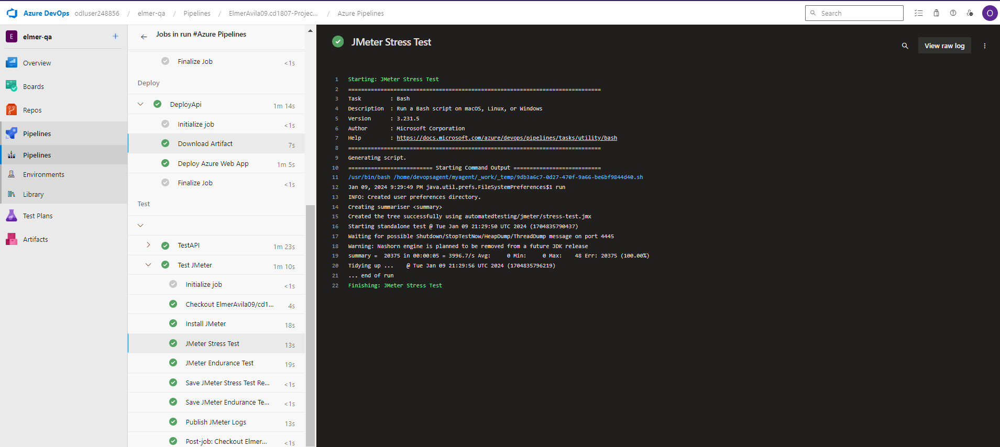
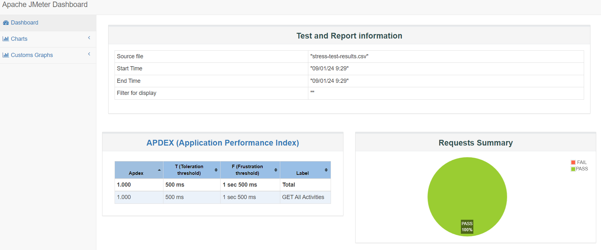

#### Endurance Testing
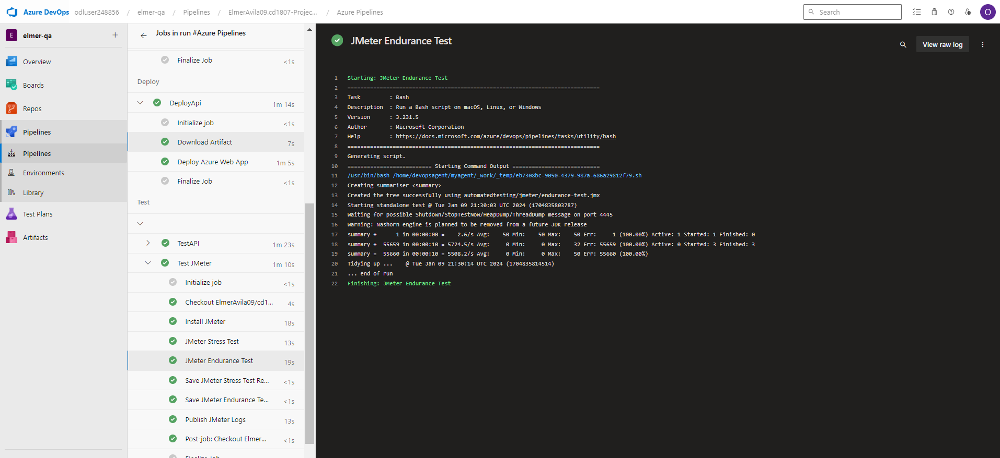
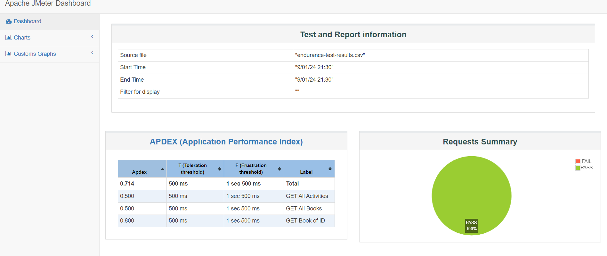

### Functional Testing Selenium
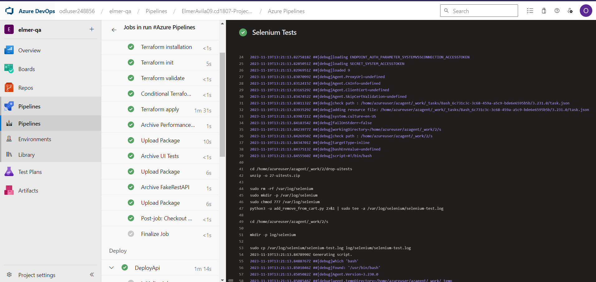

Once fully deployed, your pipeline run should look like this>
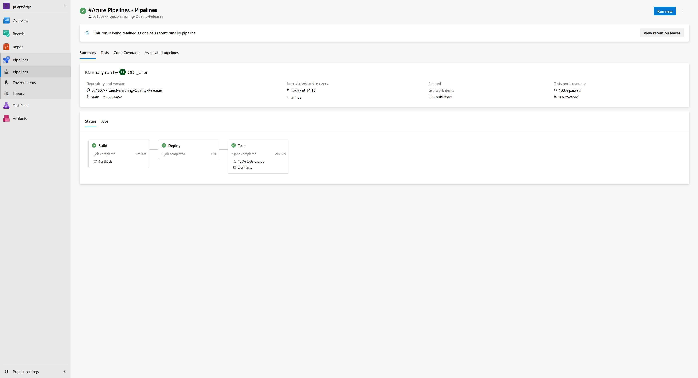

## Monitoring & Observability

Navigate to the Azure Portal and select your application service. Then, proceed to create a new alert within the "Monitoring" group:

Afterwards, run the Azure Pipeline to activate an alert.
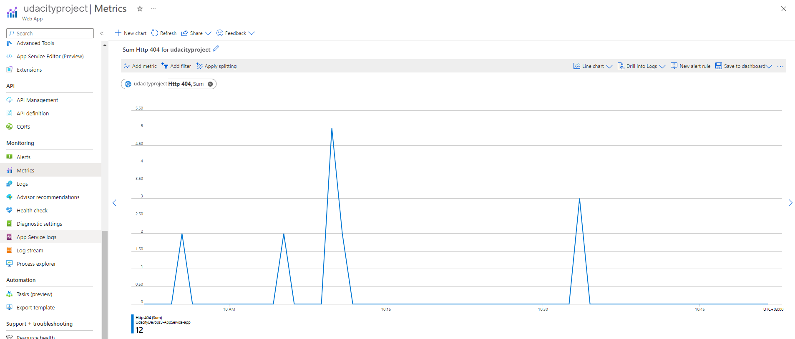

Trigger the email alert
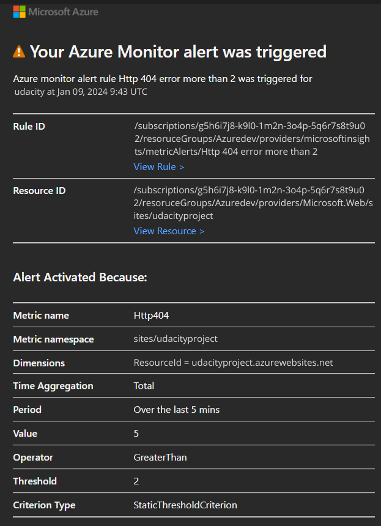


To set up Azure Log Analytics and configure it to capture logs follow these steps:

- Download `selenium-test.log `artifact from Azure DevOps. 

- Proceed to the Azure Portal, access Azure Log Analytics workspaces, and install an agent on the VM where the Selenium test will take place. Ensure that this VM is linked to Log Analytics and configure a Data Collection Rule to encompass its logs.


- Next, head to the "Logs" section and initiate the creation of a new custom log. Upload the `selenium-test.log` file. Choose "Timestamp" with the format YYYY-MM-DD HH:MM:SS as the record separator, and specify the log collection path as the path of `selenium-test.log` from the VM where the step was executed. Please be aware that there might be a delay before the VM can start collecting the logs.

#### Query Custom Logs

Navigate to the "Logs" section within the general group of your Log Analytics. Select your custom log, and execute it.

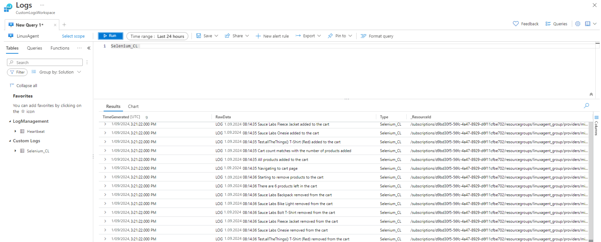